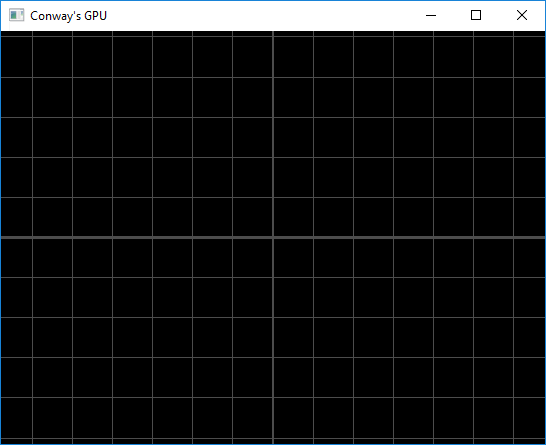

# Conway's Game Of Life

## About

_ConwaysGameOfLife_ is an old SDL2 only implementation (2017).  
_ConwaysGPU_ is the newer GPU based implementation (2019).  

[**Conway's Game of Life**](https://en.wikipedia.org/wiki/Conway%27s_Game_of_Life) implemented using _**NVIDIA**'s **CUDA**_ and  _**OpenGL**_. _**SDL2**_ is used for window management.

### Details

A _live_ cell is drawn red and "breathes". Other color effects are based on the cell age and the number of neighbours a cell has. By default the world is 1024 x 1024 cells large and it wraps around the edges.

Cells are drawn using instanced drawing of a quad whose position is calculated in the vertex shader based on the index of the current instance. The grid and other effects are all done right in the vertex and fragment shaders.

The cell states and ages are given to the vertex/fragment shader in 1 dimensional arrays of integers. Those are the arrays (_VBOs_) the CUDA code works with. The GPU is responsible for simulating one _tick_ of the Game by updating the VBO containing the states of each cell. 

_Pattern hovering_ is done on the GPU by writing special hovered status information into the cell status VBO. That information is then used in the fragment shader to highlight the pattern.

Tested on a _NVIDIA GeForce GTX 1060 (6 GB)_ GPU with _Windows 10 (64-bit)_. Compiled with _Microsoft Visual Studio Community 2017_.

### Usage
 * **Left mouse click** on a cell to toggle it's state (or set a pattern when a pattern preview is visible).
 * **Right mouse click** to rotate patterns.
 * **Mouse wheel** to zoom.
 * **WASD** keys to move around.
 * **SPACE** to pause/resume the simulation.
 * **X** to reset the simulation.
 * **C** to clear the world.
 * **R** to randomize the world.
 * **Q** and **E** to decrease/increase the tick rate.
 * **G** to show/hide grid lines.
 * **F** to show/hide special effects (cell age ...).
 * **P** to print some stats to the console.
 * **TAB** to toggle mouse over pattern previews.
 * **1** to cycle between preset _still life_ patterns.
 * **2** to cycle between preset _oscillator_ patterns.
 * **3** to cycle between preset _spaceship_ patterns.
 * **4** to cycle between other preset patterns (e.g. _shooters_).

 #### Demo
 
 
